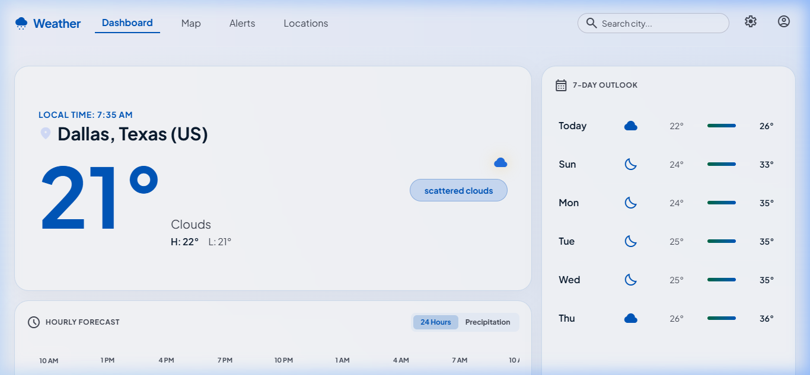
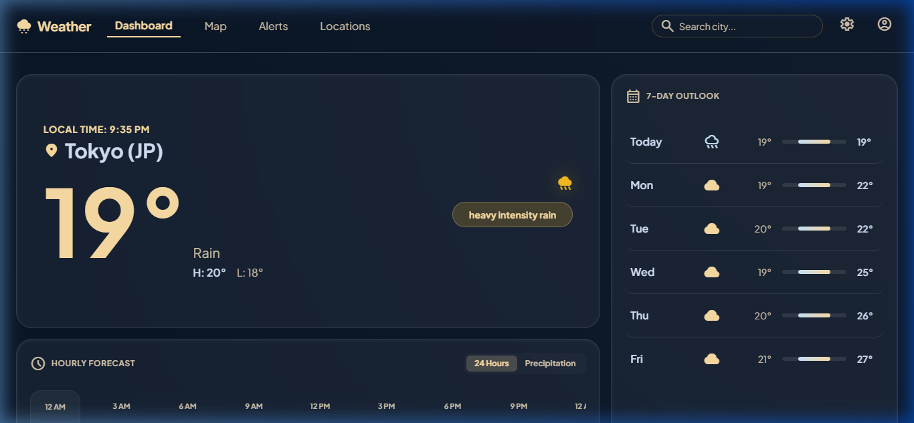
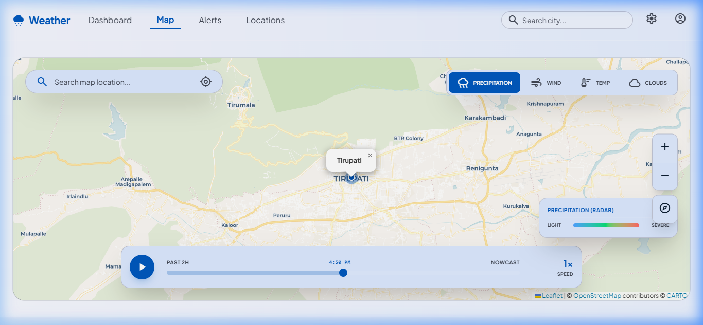
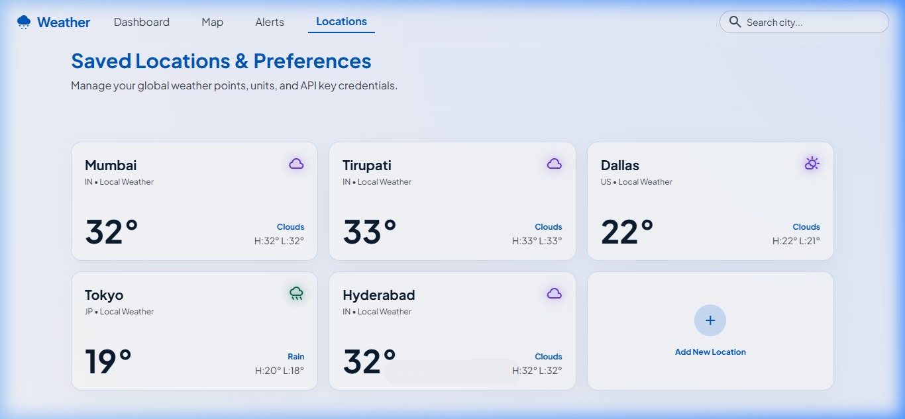

# Aether Weather Dashboard

A modern, high-performance, and visually stunning Weather Dashboard application built with **React**, **Vite**, **Tailwind CSS**, and **Leaflet**. Designed with rich aesthetics, glassmorphism, responsive bento grids, and micro-animations, this app offers a premium user experience that adapts dynamically to global locations.

---

## 🌟 Unique Selling Points (USPs) & Core Features

### 1. Dynamic Timezone-Corrected Theme Sync
Unlike standard weather apps that shift theme based on the user's browser clock, **Aether Weather** determines if it is day or night in the *target city* using the API's `timezone_offset`. Selecting **Tokyo** at 9:00 PM local time shifts the app into a dark theme, while selecting **Dallas** at 7:00 AM local time shifts the app to a light theme.
* **Light Theme (Day)**: Warm gradients and high-contrast styling.
* **Dark Theme (Night)**: Sleek, high-tech glassmorphism with cool violet and indigo glows.

### 2. Live Timezone Clock
Displays a live, real-time clock above the city name that automatically computes and ticks every 10 seconds based on the selected location's timezone.

### 3. Interactive Leaflet Maps
A dedicated Map tab renders an interactive map of the selected location, centered dynamically upon searching for a new city.

### 4. Bento-Style Saved Locations
A customizable settings page where users can manage saved locations in a sleek bento grid. Hovering over a card reveals a smooth action transition that hides the weather icon and reveals a delete option to prevent UI overlap.

### 5. API Safety & Settings
Equipped with Unit toggles (°C / °F and wind speeds in km/h, mph, or m/s) and fully integrated with secure environment variables (`.env`) to keep API keys safe.

---

## 📸 Screenshots

### ☀️ Day Theme (Dallas, TX)
*Beautiful warm gradients with a real-time local clock.*


### 🌙 Night Theme (Tokyo, JP)
*Premium glassmorphism with cool dark glow layout.*


### 🗺️ Interactive Maps
*Leaflet.js integration showing city location.*


### ⚙️ Saved Locations & Settings
*Bento grid to manage favorites and unit preferences.*


---

## 🛠️ Tech Stack & Architecture

### Core Frontend
* **React 19**: Responsive state updates, clean custom hook architecture, and lifecycle hook optimization.
* **Vite**: Ultra-fast next-gen build tool and local dev server.
* **JS ES6+**: Modern ES modules, asynchronous fetch patterns, and Promise APIs.

### Design & Styling
* **Tailwind CSS**: Utility-first CSS framework for clean responsive grid alignments and customized theme layouts.
* **Custom CSS**: Vanilla variables for theme states, high-contrast borders, and rich glassmorphic container classes.
* **Google Material Symbols**: Vector iconography used for weather states and action toggles.

### Libraries & Mapping
* **Leaflet & React-Leaflet**: Dynamic map container initialization, markers, tiles, and responsive centering.
* **OpenStreetMap**: Open-source geographical maps and tile layers.

### API Integration
* **OpenWeatherMap API**: Used for fetching coordinates, local weather, and timezone parameters.

---

## 🚀 Getting Started

### Prerequisites
* Node.js (v18 or higher)
* npm (Node Package Manager)

### Installation

1. **Clone the repository**:
   ```bash
   git clone https://github.com/Anangivignesh/Weather-App.git
   cd Weather-App
   ```

2. **Install dependencies**:
   ```bash
   npm install
   ```

3. **Set up Environment Variables**:
   Create a `.env` file in the root directory:
   ```env
   VITE_WEATHER_API_KEY=your_openweathermap_api_key
   ```

4. **Run the Development Server**:
   ```bash
   npm run dev
   ```
   Open `http://localhost:5173` in your browser.

5. **Build for Production**:
   ```bash
   npm run build
   ```